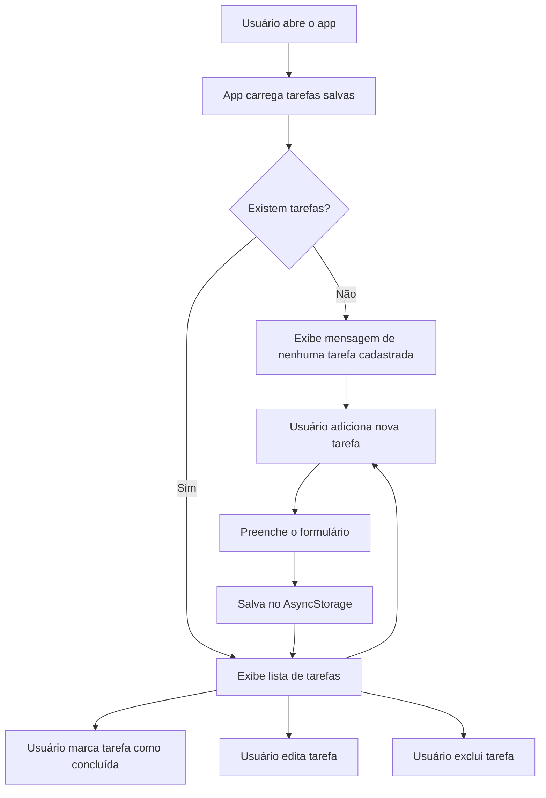

# TaskFlow — Gerenciador de Tarefas Mobile

<p align="center">
  
  
  
  
  
</p>

<p align="center">
  Aplicativo mobile para gerenciamento de tarefas, com funcionalidades de cadastro, edição, conclusão, exclusão e armazenamento local.
</p>

---

## Sobre o Projeto

O **TaskFlow** é um aplicativo mobile desenvolvido com **React Native**, **Expo** e **JavaScript**, criado para auxiliar no controle e organização de tarefas do dia a dia.

A aplicação permite que o usuário cadastre novas tarefas, edite tarefas existentes, marque tarefas como concluídas e exclua atividades que não são mais necessárias.

O projeto utiliza **AsyncStorage** para salvar as tarefas localmente no dispositivo, permitindo que os dados sejam mantidos mesmo após fechar o aplicativo.

Além disso, o app utiliza navegação entre telas com **React Navigation**, separando a tela principal da lista de tarefas e a tela de formulário para criação ou edição.

---

## Descrição Curta

Aplicativo mobile de lista de tarefas desenvolvido com React Native e Expo, permitindo criar, editar, concluir e excluir tarefas com armazenamento local no dispositivo.

---

## Objetivo do Projeto

O objetivo do **TaskFlow** é criar um aplicativo simples e funcional para gerenciamento de tarefas, praticando conceitos essenciais do desenvolvimento mobile.

Com esse projeto, é possível praticar:

* desenvolvimento mobile com React Native;
* uso do Expo;
* criação de interfaces com componentes nativos;
* controle de estado com React Hooks;
* navegação entre telas;
* armazenamento local com AsyncStorage;
* criação, edição e exclusão de dados;
* validação de campos;
* uso de listas com FlatList;
* uso de ícones na interface;
* estilização com StyleSheet.

---

## Funcionalidades

* Listagem de tarefas cadastradas.
* Cadastro de nova tarefa.
* Edição de tarefa existente.
* Exclusão de tarefa.
* Confirmação antes de excluir.
* Marcação de tarefa como concluída.
* Remoção visual com texto riscado em tarefas concluídas.
* Armazenamento local das tarefas.
* Recuperação automática das tarefas salvas.
* Navegação entre tela inicial e formulário.
* Validação para impedir tarefa vazia.
* Mensagem quando não há tarefas cadastradas.
* Interface simples, limpa e organizada.

---

## Tecnologias Utilizadas

| Tecnologia                | Finalidade                         |
| ------------------------- | ---------------------------------- |
| React Native              | Desenvolvimento mobile             |
| Expo                      | Execução e gerenciamento do app    |
| JavaScript                | Linguagem principal                |
| React Hooks               | Controle de estado e ciclo de vida |
| AsyncStorage              | Armazenamento local das tarefas    |
| React Navigation          | Navegação entre telas              |
| Native Stack Navigator    | Navegação em pilha                 |
| React Native Vector Icons | Ícones da interface                |
| StyleSheet                | Estilização dos componentes        |

---

## Estrutura do Projeto

```text
TaskFlow/
│
├── App.js
├── app.json
├── babel.config.js
├── package.json
├── package-lock.json
├── README.md
│
└── docs/
    └── images/
        ├── home.png
        ├── nova-tarefa.png
        └── editar-tarefa.png
```

---

## Descrição dos Principais Arquivos

### `App.js`

Arquivo principal da aplicação.

Ele contém toda a estrutura do app, incluindo:

* configuração da navegação;
* tela inicial;
* tela de formulário;
* funções de salvar e buscar tarefas;
* criação de novas tarefas;
* edição de tarefas;
* exclusão de tarefas;
* marcação de tarefa como concluída;
* estilos da interface.

---

### `app.json`

Arquivo de configuração do Expo.

Nele são definidos dados do aplicativo, como:

* nome do app;
* slug;
* versão;
* orientação da tela;
* estilo da interface;
* configurações para Android.

---

### `package.json`

Arquivo responsável por armazenar as informações do projeto e suas dependências.

Ele também contém os scripts para executar o aplicativo.

---

### `babel.config.js`

Arquivo de configuração do Babel utilizado pelo Expo para transpilar o código JavaScript.

---

## Telas do Aplicativo

### Home

A tela **Home** é a tela principal do aplicativo.

Ela exibe:

* título do app;
* subtítulo com as tecnologias utilizadas;
* botão para adicionar tarefa;
* lista de tarefas cadastradas;
* mensagem quando não há tarefas;
* botão para marcar como concluída;
* botão para editar;
* botão para excluir.

---

### Formulário

A tela **Formulário** é usada tanto para criar quanto para editar tarefas.

Quando o usuário cria uma nova tarefa, a tela exibe:

```text
Nova tarefa
```

Quando o usuário edita uma tarefa existente, a tela exibe:

```text
Editar tarefa
```

O botão também muda conforme o modo:

```text
SALVAR TAREFA
```

ou

```text
SALVAR ALTERAÇÕES
```

---

## Como Funciona o Armazenamento

O app utiliza o **AsyncStorage** para salvar as tarefas no armazenamento local do dispositivo.

A chave utilizada para armazenar os dados é:

```text
@tarefas_app
```

As tarefas são salvas em formato JSON.

Cada tarefa possui a seguinte estrutura:

```json
{
  "id": "1720000000000",
  "titulo": "Estudar React Native",
  "concluida": false
}
```

---

## Fluxo de Funcionamento



---

## Como Executar o Projeto

### 1. Clone o repositório

```bash
git clone https://github.com/seu-usuario/TaskFlow.git
```

---

### 2. Acesse a pasta do projeto

```bash
cd TaskFlow
```

---

### 3. Instale as dependências

```bash
npm install
```

---

### 4. Corrija dependências do Expo, se necessário

```bash
npx expo install --fix
```

---

### 5. Execute o projeto

```bash
npx expo start -c
```

---

### 6. Abra o aplicativo

Após iniciar o Expo, você pode abrir o app de três formas:

* pelo aplicativo **Expo Go** no celular;
* em um emulador Android;
* no navegador, usando a opção web.

Comandos úteis:

```bash
npm run android
npm run ios
npm run web
```

---

## Scripts Disponíveis

| Comando             | Descrição                         |
| ------------------- | --------------------------------- |
| `npm start`         | Inicia o projeto com Expo         |
| `npm run android`   | Abre o projeto no Android         |
| `npm run ios`       | Abre o projeto no iOS             |
| `npm run web`       | Abre o projeto no navegador       |
| `npx expo start -c` | Inicia o projeto limpando o cache |

---

## Dependências do Projeto

Dependências principais utilizadas:

```json
{
  "@react-native-async-storage/async-storage": "2.2.0",
  "@react-navigation/native": "^6.1.18",
  "@react-navigation/native-stack": "^6.11.0",
  "babel-preset-expo": "~54.0.10",
  "expo": "^54.0.0",
  "expo-status-bar": "~3.0.8",
  "react": "19.1.0",
  "react-native": "0.81.5",
  "react-native-safe-area-context": "~5.6.0",
  "react-native-screens": "~4.16.0",
  "react-native-vector-icons": "^10.2.0"
}
```

---

## Como Usar o Aplicativo

1. Abra o aplicativo.
2. Toque em **Adicionar Tarefa**.
3. Digite a descrição da tarefa.
4. Toque em **Salvar Tarefa**.
5. A tarefa será exibida na tela inicial.
6. Toque no círculo ao lado da tarefa para marcar como concluída.
7. Toque no ícone de edição para alterar a tarefa.
8. Toque no ícone de lixeira para excluir a tarefa.
9. Confirme a exclusão quando o alerta aparecer.

---

## Exemplo de Uso

Um usuário deseja organizar suas atividades do dia.

Ele abre o **TaskFlow**, adiciona tarefas como estudar, fazer exercícios e revisar um trabalho acadêmico.

Ao finalizar uma atividade, marca a tarefa como concluída. Caso precise corrigir algum texto, utiliza a opção de edição. Se uma tarefa não for mais necessária, pode excluí-la da lista.

---

## Sugestões de Nome Alternativo

Caso queira outro nome para o projeto, algumas opções são:

* TaskFlow
* TaskList
* Minha Lista
* Organiza+
* CheckTask
* Meu Planner
* Tarefa Fácil
* Lista Rápida
* DoneApp
* TaskControl

---

## Possíveis Melhorias Futuras

Algumas melhorias que podem ser implementadas futuramente:

* Criar categorias para as tarefas.
* Adicionar prioridade: baixa, média e alta.
* Adicionar data de vencimento.
* Criar filtro por tarefas concluídas e pendentes.
* Criar contador de tarefas concluídas.
* Adicionar tela de resumo.
* Adicionar modo escuro.
* Adicionar animações ao concluir tarefa.
* Adicionar busca de tarefas.
* Permitir ordenar tarefas por data.
* Criar notificações de lembrete.
* Melhorar responsividade para versão web.
* Separar telas e componentes em arquivos diferentes.
* Criar uma pasta `src`.
* Adicionar testes automatizados.
* Publicar o app.

---

## Pontos de Atenção

* O projeto está centralizado no arquivo `App.js`.
* As tarefas são salvas localmente no dispositivo.
* O app não possui backend ou banco de dados externo.
* Se os dados do aplicativo forem apagados no dispositivo, as tarefas também serão removidas.
* O projeto é simples e ideal para fins de estudo.
* Algumas melhorias podem ser feitas futuramente para transformar o app em uma solução mais completa.

---

## Como Adicionar Imagens no README

Para que os prints apareçam no GitHub:

1. Crie a pasta:

```text
docs/images/
```

2. Tire prints das telas do aplicativo.

3. Salve os arquivos com estes nomes:

```text
home.png
nova-tarefa.png
editar-tarefa.png
```

4. Os caminhos já estão configurados no README:

```html


```

---

## Observações Importantes

* O app foi desenvolvido com Expo.
* O arquivo principal é o `App.js`.
* O armazenamento local é feito com AsyncStorage.
* A navegação é feita com React Navigation.
* A interface utiliza ícones do Material Icons.
* Para melhor experiência, recomenda-se testar o app no Expo Go ou em um emulador Android.

---

## Autor

Projeto desenvolvido por **Matheus Soares** para fins acadêmicos e de aprendizado, com foco em desenvolvimento mobile, React Native, Expo, JavaScript, criação de lista de tarefas, navegação entre telas e armazenamento local com AsyncStorage.

---

## Licença

Este projeto é de uso acadêmico e educacional.
